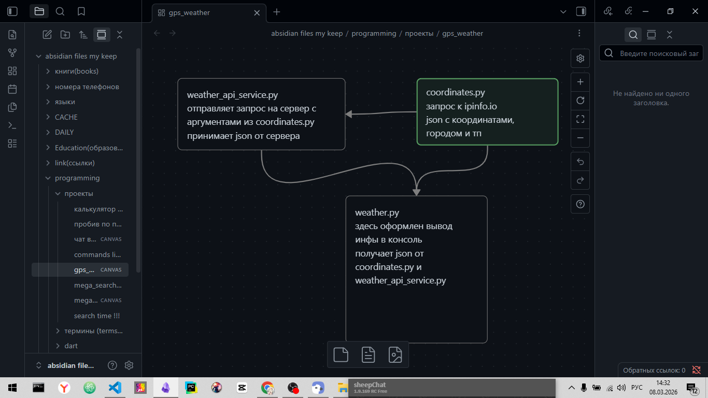

# gps_weather
прога показывающая погоду🌩️ по текущему месту положению(начал разработку в образовательных целях🎯, в том смысле🧠, чтоб научиться пользоваться API🌐)

не думал что [так разбивают функционал по модулям](https://to.digital/typed-python/weather/structure.html)
надо взять на заметку 👁️‍🗨️💻🚀

### расписываю функционал📃:
- прием примерных кординат 1 отдельный файл 📜
- запрос погоды по API тоже отдельный файл 📋
- форматирование и вывод в терминал, угадайте что😅, тоже отдельный файл 📑
    - причем файл должен называться так как называеться прога💽 чтоб потом было удобно пользоваться
    - и придать ему соответствующие права в chmod🛅 для открытия🚪

### установка проги на windows>=8
...

### визуализация кода
